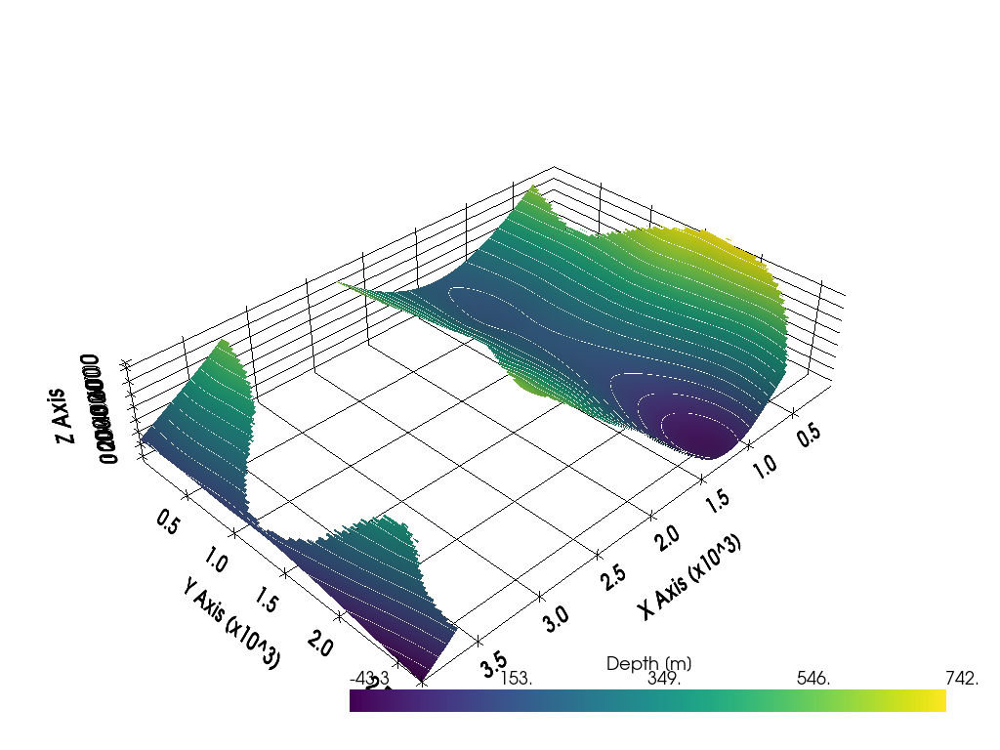

# Summary

The geological map-to-model tutorials presented enable users of the **GemPy** and **GemGIS** Python libraries and associated packages to create structural geological models from scratch using input data for conceptual models but also more sophisticated models representing possible real-world examples. Text book geological maps and cross sections [e.g., @{bennison}; @{powell}] are transformed into structural models serving as teaching materials for undergraduate students in the field of Applied Geosciences at RWTH Aachen University, Germany. Their purpose is to enable students to not only think about geological problems in 2D (map view) but also in 3D (current structure of the subsurface) and even 4D (depositional, tectonic and erosional events resulting in the current structural framework). The purpose of creating these models is not to substitute the necessary analog thinking of geoscientists but to aid them in verifying their results, to advance 3D thinking skills and to introduce students to the world of data processing, data visualization, data analysis and structural geological modeling in Python.

# Statement of Need 

The subsurface below our feet is utilized in many different ways. We extract fresh water, thermal waters and fossil fuels from it. We exploit the subsurface for its coal, minerals and ores in open-pit mines and underground mines. We store fluids and gases as well as nuclear waste in the subsurface. But to do so, a concept of the structure of the subsurface and its properties is needed to drill into the right formation, to dig or drill into the right direction, to ensure that none of the stored fluid escapes and to ensure that no contaminants leak into surrounding rocks. 

Creating structural geological models not only in 1D boreholes or 2D cross-sections but also in 3D models is a first step to gain a comprehensive knowledge of the subsurface. Apart from actually drawing models, most efforts to create structural geological models in 3D are built in and restricted to commercial software packages such as GeoModeller [@{geomodeller}], Petrel, Move, GoCad [@{gocad}] and others. The aim of **GemPy** [@{gempy}] and **GemGIS** [@{gemgis}] and associated open-source packages is to provide open-source software tools to create 3D structural geological models from maps, cross sections, borehole information, stratigraphic boundaries at the surface and the subsurface, orientation measurements of the stratigraphic units, mapped horizons from seismic data or information inferred from other geophysical methods. 

The tutorial materials presented here are adopted from a mapping class for undergraduate students majoring in Applied Geosciences at RWTH Aachen University, Germany. The purpose of this paper-based analog course is to develop the 3D geological thinking of the students and to allow them to obtain a concept of the structures in the subsurface through constructing and analyzing maps and 2D cross-sections [@{bennison}; @{powell}]. The tutorials presented here can be seen as the logical continuation of the introductory mapping course. These tutorials motivate students to dig deeper into the data or to confirm their previous results. The barrier to utilize the Python language and associated packages for processing and visualizing data is lowered by the use of these tutorials. The usage of 3D structural models in teaching has also been adapted to make use of AR-Sandboxes [@{Wellmann2022}]. Here, models created through **GemGIS** and **GemPy** can be recreated in the AR-Sandbox. A generation of a modified map can then be triggered by manual interaction with sand, hence changing the topography of the model.  

# Resources
The following resources are provided before going through the tutorials. It is recommended to use an [Anaconda Python distribution](https://www.anaconda.com/) and [Jupyter Notebooks](https://jupyter.org/) to access the tutorials. Both **GemPy** and **GemGIS** have been developed in recent years at the [Department for Computational Geosciences and Reservoir Engineering at RWTH Aachen University, Germany](https://www.cgre.rwth-aachen.de/). Both libraries are stored on Github and have well-documented resources:

- [Tutorial Repository](https://github.com/cgre-aachen/gemgis_data)
- [GemGIS Documentation and Installation](https://gemgis.readthedocs.io/)
- [GemGIS Repository](https://github.com/cgre-aachen/gemgis)
- [GemPy Documentation and Installation](https://www.gempy.org)
- [GemPy Repository](https://github.com/cgre-aachen/gemgpy)

# Learning Objectives

Upon completion of the tutorials, the users will have learnt to:

- Create the necessary raw data for **GemGIS** and **GemPy** using the open-source software QGIS [@{QGIS_software}]
- Explore and manipulate the raw data using the Pandas [@{pandas}] and GeoPandas libraries [@{geopandas}]
- Process the raw data using **GemGIS** to create input data for **GemPy**
- Create the 3D structural model using **GemPy**
- Visualize the results using Matplotlib [@{matplotlib}] and PyVista [@{pyvista}]
- Perform post-processing tasks 
- Applying the different steps of the model building to user's own maps and datasets. 

# Contents and instructional design

The tutorials are organized in a modular fashion and consist of seven units as shown below. For each model, all the input data and a QGIS project are already shipped with the repository for users to explore the original maps and to be able to reproduce the input data for the structural modeling. With this material, the user will also develop awareness on how to process one's own datasets for future structural modeling. The notebooks also contain common post-processing tasks on how to utilize the created structural geological models. 

- Basic structural geological modeling with **GemPy** (4 notebooks)
- Modeling planar dipping layers with **GemGIS** and **GemPy** (3 notebooks) 
- Modeling folded layers with **GemGIS** and **GemPy** (3 notebooks) 
- Modeling faulted layers with **GemGIS** and **GemPy** (3 notebooks) 
- Modeling unconformable layers with **GemGIS** and **GemPy** (3 notebooks) 
- Modeling combinded models with **GemGIS** and **GemPy** (3 notebooks) 
- Modeling special cases with **GemGIS** and **GemPy** (3 notebooks) 

## Basic Structural Geological Modeling with GemPy
**GemPy** is capable of modeling planar layers, folded layers, faulted layers, truncated layers and combinations of the aforementioned structures. The required input data for building a structural model in **GemPy** consists of locations for stratigraphic boundaries encountered on the surface (outcrops, maps, mines), or in the subsurface (boreholes, geological cross sections, seismic data, or constraints from other geophysical methods) and orientation measurements representing the dip and the azimuth of the respective stratigraphic unit also measured on the surface or in the subsurface. The input is loaded and assigned to different interpolation fields, where each field represents conformal surfaces which are modeled using one scalar field (implicit surface representation approach [@{Lajaunie1997}]). Through the interaction of multiple scalar fields, it is possible to represent non-conformal features, unconformities and the effect of faults. Each fault is attributed to its own scalar field. The interpolation itself is performed through a meshless interpolation algorithm, and a marching cube algorithm is subsequently used to create PyVista meshes from the interpolated fields for further visualization and post-processing.

The first four notebooks illustrate how to create the different structures that **GemPy** is capable of modeling (Fig. \ref{fig1}): 

- Planar layers
- Folded layers
- Faulted layers
- Truncated layers

## Model Building using teaching materials

In the section for the basic structural geological, models are presented where only one structural feature is present. Later on in the tutorial, the models include combinations of structural elements and therefore more complex models (Fig. \ref{fig3}). In addition, a topography is added to the models based on contour lines provided with the geological maps [@{bennison}; @{powell}]. 

The biggest advantage of this tutorial is that the input data is not provided as a CSV-file but as Shape-Files created by the user in a GIS environment such as QGIS (Fig. \ref{fig2}). Here, the user should already be aware which coordinate reference system the data is provided in. Using a cartesian coordinate system is recommended for the **GemPy** input data.

The very first step is to extract the maps from the teaching materials, to process it in an image editing software and to georeference it using QGIS. The scale of the image must be honored. Otherwise, calculated dipping angles will not correspond to the original angles in the map. Then, the contour lines of the map are digitized as LineStrings and the height information of each line is stored in the attribute table. A digital elevation model is calculated using **GemGIS** (Fig. \ref{fig3}). The stratigraphic boundaries are also digitized as LineStrings (Fig. \ref{fig3}). The formation the boundaries belong to is saved in the attribute table as well. The X and Y information are extracted from the vertices, the Z information is sampled from the digital elevation model at the respective positions as these boundaries were recorded on the surface. The orientations cannot be extracted from the maps directly. Here, we make use of the fact that orientations (dip and azimuth) can be calculated in **GemGIS** from a set of two parallel lines ("strike-lines") with given vertical distance and measured horizontal distance connecting two outcropping points at the same altitude at the surface each. All data sets/Shape-Files created in QGIS are loaded using the GeoPandas library and processed using **GemGIS** to generate the necessary input DataFrames and the digital elevation model for **GemPy**. 

Examples 1 to 3 (e.g. Fig. \ref{fig2}) introduce planar dipping layers with the topography created from contour lines, orientations either provided or calculated from "strike-lines" and custom cross-sections displaying a 2D view along a given transect. Examples 4 to 12 present models with folded, faulted and unconformable layers. Notebooks 13 to 15 present combinations of different structures and hence more complex models. Notebooks 16 to 18 introduce solutions to the so-called "three-point-problems" in geology which can be solved with the help of **GemGIS**. Additional models are provided to complement the tutorials if more practice is needed.

{ width=80% }

## Post-Processing of Models

Common post-processing tasks utilizing the structural geological models are addressed at the end of several notebooks. These methods include, but are not limited to:

### Creating depth maps and contour lines for single stratigraphic boundaries 

**GemGIS** is capable of creating depth maps and contour lines from **GemPy** meshes for further analysis (Fig. \ref{fig4}). In addition, these depth maps can be exported as ZMAP files for map visualizations in QGIS.

{ width=75% } 

### Creating virtual boreholes and extract depths of intersected stratigraphic boundaries 

A very simple well sampling tool has been implemented to extract the intersected stratigraphic boundaries by an already existing well or by a planned well trajectory to validate the structural geological model or to propose a well prognosis, respectively (Fig. \ref{fig5}).

{ width=75% }

## Creating ready-for publishing 3D models with Blender 

To maximize the learning outcome, additional visualization techniques can be accessed. The open-source developed 3D creation suite Blender provides tools to model and edit meshes, to animate models and to render the final result (Fig. \ref{fig6}). Ray tracing technologies and complex shaders for materials allow the creation of photorealistic renders of models [@{Blender}]. This way, the lecturer is capable of highlighting key aspects of geological models and producing attractive figures or videos on a professional level. 

{ width=80% }

### Transferring the models to an AR-Sandbox using Open AR-sandbox (augmented reality sandbox)

Structural geological models created with **GemGIS** and **GemPy** can be transferred to an Open AR-Sandbox (Fig. \ref{fig7}) [@{Wellmann2022}]. After recreating the original topography, the original structural model or the geological map will be displayed, respectively. By modifying the sandbox topography, the geological map being displayed will be updated accordingly. 

![Geological model representation using Open AR-Sandbox [@{Wellmann2022}]: (A) digitization in GIS [@{bennison}]. (B) Reconstruction of topography in AR-Sandbox. (C) Generated 3-D model. (D) Geological map, calculated from 3-D geomodel and topography, projected in AR-Sandbox, view similar to original map. (E) and (F): modified topographies and updated geological map projections.  \label{fig7}](./images/fig7.png)

# Experience of use in teaching and learning situations

The tutorials are currently linked to two courses at RWTH Aachen University, Germany, in two different undergraduate programs. These are [B.Sc. Applied Geosciences]{https://www.rwth-aachen.de/cms/root/studium/Vor-dem-Studium/Studiengaenge/Liste-Aktuelle-Studiengaenge/Studiengangbeschreibung/~bqxx/Angewandte-Geowissenschaften-B-Sc/?lidx=1} and [B.Sc. Georesources Management]{https://www.rwth-aachen.de/cms/root/studium/Vor-dem-Studium/Studiengaenge/Liste-Aktuelle-Studiengaenge/Studiengangbeschreibung/~bllm/Georessourcenmanagement-B-Sc/?lidx=1}. The courses themselves are "Geological methods and geological maps" and "Introduction to geological maps", respectively. Both courses are taught twice a week for the entire semester for 1.5 h each with one teaching session and one tutorial session with two instructors and a maximum of 30 students with a total workload of 60 h or 30 h for the respective program. The students have to construct one model per week and present it during the tutorial session. 

The tutorials can easily be taught by other teaching instructors to their students. The requirements to do so include general knowledge of the Python ecosystem including libraries like NumPy, Matplotlib, Pandas or GeoPandas. Furthermore, the instructor should be somewhat familiar with the **GemPy** and **GemGIS** libraries to be able to explain the different steps of the data processing workflow and the structural modeling itself. Knowledge about the implicit modeling theory **GemPy** builds upon is helpful. 

Structural geological models are the first models needed for further modeling tasks or simulations in many different fields, e.g. groundwater studies, geothermal exploration, oil and gas exploration, mining, and geohazard assessments. Students being aware of the possibility to create structural geological models for later projects or thesis work with **GemPy** and **GemGIS** are much more likely to engage in these kinds of projects as they know how to create the first fundamental piece necessary for a particular research question. Several bachelor and master projects at RWTH Aachen University have therefore been performed with the aid of these Python packages already. 

# CRediT author statement

- AJ: Conceptualization of the tutorial series, Development of the GemGIS Software, Creation of the tutorial models, Writing first version of the manuscript
- MdlV: Software Development and Maintenance of the GemPy Software,
- NC: Review and editing of the manuscript, Blender visualization
- SB: Providing the resources (maps) for the tutorials as part of his class at RWTH, Review and editing of the manuscript
- FW: Review and editing of the manuscript, Supervision and Administration for the GemPy and GemGIS projects

# Acknowledgements

All authors would like to thank the [Software Underground](https://softwareunderground.org/)  for providing a platform to interact with users and to organize hackathons (Transform 2020/2021) to further develop the open-source package. 
We also acknowledge contributions from, and thank all our users for reporting bugs, raising issues and suggesting improvements to the APIs of **GemGIS** and **GemPy**. 

# References
